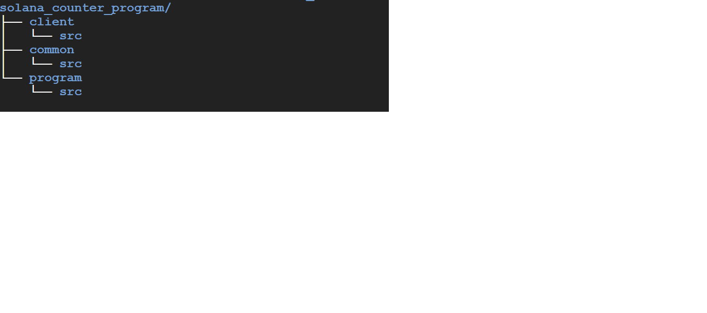
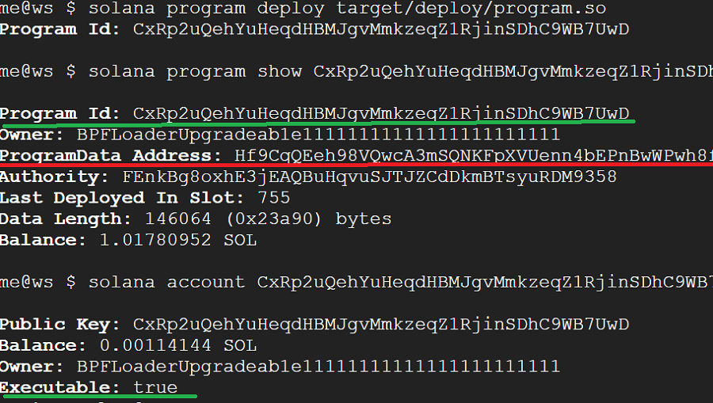

<p align="center">
  <a href="https://solana.com">
    
  </a>
</p>

[![Build status][travis-image]][travis-url] [](https://gitpod.io/#https://github.com/solana-labs/example-helloworld)

[travis-image]:
https://travis-ci.org/solana-labs/example-helloworld.svg?branch=master
[travis-url]: https://travis-ci.org/solana-labs/example-helloworld

# Rust counter program and client on solana

This project demonstrates how to use solana rust APIs to write a counter program and client in rust.

The project comprises of:

* An on-chain counter program
* A rust client that can send a "Increament" counter message to the on-chain program and get the current reading.

## Table of Contents
- [Counter program and client](#counter_program_and_client)
  - [Table of Contents](#table-of-contents)
  - [Quick Start](#quick-start)
    - [Configure CLI](#configure-cli)
    - [Start local Solana cluster](#start-local-solana-cluster)
    - [Build the on-chain program](#build-the-on-chain-program)
    - [Deploy the on-chain program locally](#deploy-the-on-chain-program-locally)
    - [Deploy to devnet](#deploy-to-devnet)
    - [Deploy to testnet](#deploy-to-testnet)
    - [Run the rust client](#run-the-rust-client)
    - [Expected output](#expected-output)
      - [Not seeing the expected output?](#not-seeing-the-expected-output)
    - [Project structure](#project-structure)

  - [More about the client](#more-about-the-client)
    - [Entrypoint](#entrypoint)
    - [Establish a connection to the cluster](#establish-a-connection-to-the-cluster)
    - [Load the helloworld on-chain program if not already loaded](#load-the-helloworld-on-chain-program-if-not-already-loaded)
    - [Send a "Hello" transaction to the on-chain program](#send-a-hello-transaction-to-the-on-chain-program)
    - [Query the Solana account used in the Hello transaction](#query-the-solana-account-used-in-the-hello-transaction)
  - [More about the on-chain program](#more-about-the-on-chain-program)
    - [Programming on Solana](#programming-on-Solana)
  - [Pointing to a public Solana cluster](#pointing-to-a-public-solana-cluster)
  - [Expand your skills with advanced examples](#expand-your-skills-with-advanced-examples)

## Quick Start

[](https://gitpod.io/#https://github.com/solana-labs/example-helloworld)

If you decide to open in Gitpod then refer to
[README-gitpod.md](README-gitpod.md), otherwise continue reading.

The following dependencies are required to build and run this example:

- Install Rust v1.60.0 or later from https://rustup.rs/
- Install Solana v1.10.5 or later from
  https://docs.solana.com/cli/install-solana-cli-tools

If this is your first time using Rust, these [Installation
Notes](README-installation-notes.md) might be helpful.

### Configure CLI

> If you're on Windows, it is recommended to use [WSL](https://docs.microsoft.com/en-us/windows/wsl/install-win10) to run these commands

1. Set CLI config url to localhost cluster

```bash
solana config set --url localhost
or 
solana config set -ul

```

2. Create CLI Keypair

If this is your first time using the Solana CLI, you will need to generate a new keypair:

```bash
solana-keygen new
```

### Start local Solana cluster

This example connects to a local Solana cluster by default.

Start a local Solana cluster:
```bash
solana-test-validator
```
If you want start with a clean slate after couple of trials, you can do:

```bash
solana-test-validator --reset
```

> **Note**: You may need to do some [system tuning](https://docs.solana.com/running-validator/validator-start#system-tuning) (and restart your computer) to get the validator to run

On-chain deployed program's logs can be viewed by launcing a separate terminal and firing the following command:
```bash
solana logs
```
> **None**: For logging messages inside the on-chain program, we should use the `msg!` [macro](https://docs.solana.com/developing/on-chain-programs/developing-rust#logging).

### Build the on-chain program

Go inside the 'solana_counter_program' directory if not already done:

```bash
cd solana_counter_program

cargo build-bpf
```
### Deploy the on-chain program locally

```bash
solana program deploy target/deploy/program.so
```

### Run the rust client

```bash
cargo run
```

### Expected output

Values will differ!

```bash
Connecting to cluster...http://localhost:8899
Connection to cluster established
Cluster node solana version 1.10.5
Counter account B6rWFbQ4pmb4pvcZstFCjLXffZSaqqn6c8fdXzpK3WSX already exists. Owner program: HGsPi7r4MEeUSC74vzx9qCqJvuuBb3AcjNc5MrtEjCGu
Binary address 8cRrhLjJ7sSbSa1kuaShq2Ywu1otyRhkNwTQ3E1Bqr4T
Fee for message 5000
Counter value 1

```

#### Not seeing the expected output?

- Ensure you've [started the local cluster](#start-local-solana-cluster),
  [built the on-chain program](#build-the-on-chain-program) and [deployed the program to the cluster](#deploy-the-on-chain-program).
  
  

### Deploy to devnet

```bash
solana config set --url d
solana program deploy target/deploy/program.so
```
#### Or
### Deploy to testnet

```bash
solana config set -ut

solana program deploy target/deploy/program.so
```

> **Note**: You may not have required sol balance to deploy and run transactions in devnet or testnet. To request sol into your account do an airdrop:

#### Check account sol balance:
```bash
solana balance
```
#### Request sol airdrop:
```bash
solana airdrop 1
```

#### Run the client:
```bash
cargo run
```

### Project structure

The following image shows the project layout. We are making use of cargo [workspaces](https://doc.rust-lang.org/book/ch14-03-cargo-workspaces.html).
- [program](https://github.com/ratulb/solana_counter_program/tree/main/program) - this is the on-chain counter program
- [client](https://github.com/ratulb/solana_counter_program/tree/main/client) - this is the rust client program that invokes the program to increament the counter.
- [common](https://github.com/ratulb/solana_counter_program/tree/main/common) - this crate contains the enum/structs shared by both program and client.

<p align="left">
  <a href="#project_structure">
    
  </a>
</p>

For experimentation, tweaking files under the program folder would require [rebuild](#build-the-on-chain-program) and [redeployment](#deploy-the-on-chain-program-locally).

Now when you rerun `cargo run`, you should see the results of your changes.
## More about the client

The client is a rust cli [program](https://github.com/ratulb/solana_counter_program/blob/main/client/src/main.rs) with a main function.

#### Main function

The [main function](https://github.com/ratulb/solana_counter_program/blob/27d5aa6aa4c7ec14fe049837e8beff4bb7548f3e/client/src/main.rs#L5) does following five things:


#### Instantiates the client that wraps up an underlying RpcClient

[Client](https://github.com/ratulb/solana_counter_program/blob/main/client/src/client.rs)
creates an instance of [RpcClient](https://docs.rs/solana-client/latest/solana_client/rpc_client/struct.RpcClient.html) in its [get_rpc_client](https://github.com/ratulb/solana_counter_program/blob/8ca2bd8130d0f385d2720b2623abf7f0965e0566/client/src/client.rs#L48) methhod. This sets up a Http client to the solana network that is picked up from `~/.config/solana/cli/config.yml`. Once the client has been setup - we can start interacting with solana network for things like querying about accounts, sending transactions, getting cluster related information and much more. The exhaustive list can be found [here](https://docs.rs/solana-client/latest/solana_client/rpc_client/struct.RpcClient.html#implementations).

The `json_rpc_url` entry in the `config.yaml` file gets configured via the following command:
```bash
solana config set --url localhost[devnet, testnet etc]
```

#### Setup an account to store counter program's state

Solana on-chain programs are stateless and immutable(which is different from upgradable - we can keep modifying and deploying a program again and again so long as we don't supply the `--final` flag to `solana program deploy program.so` or don't use `solana deploy program.so` - which sets up 'BPFLoader2111111111111111111111111111111111' loader as program owner instead of `BPFLoaderUpgradeab1e11111111111111111111111` and does not allow us to upgrade the program further unless we specify different program address). Also, looking at the program [crate_type](https://github.com/ratulb/solana_counter_program/blob/main/program/Cargo.toml#L14), we see that `crate-type` is "cdylib", "lib". We can ommit the "lib" type that would work just fine. "cdylib" produces a .so file in linux and .dll file in windows. These are shared libraries - they do not maintain state across invocations! Where then our increamental counter value would be stored? Well, you may have guessed it - in accounts. Its accounts all the way down. If a program in solana wants to persist state, it would have to make use of accounts that it owns.

Also, programs themselves are stored in accounts - they are marked as executable. For more information about account see [here](https://docs.rs/solana-sdk/latest/src/solana_sdk/account.rs.html#22-34).


> **Note**: There is limit on how much storage space(currently 10MB) an account can have. Space incurs cost. Incurred cost is paid via rent. An account can be rent exempt if it maintains atleast two years worth of rent as balance in its account. See more [here](https://docs.solana.com/developing/programming-model/accounts). On-chain programs are expected to be rent exempt otherwise they would be purged from the chain. Amount of lamports required for an account to be rent exempt can be calculated [programmatically](https://docs.rs/solana-client/latest/src/solana_client/rpc_client.rs.html#3531-3536) or via the cli as shown:
```bash
solana rent 1000 [in bytes]
```
On entry to the [account setup process](https://github.com/ratulb/solana_counter_program/blob/main/client/src/client.rs#L163-L165), we retrieve the payer pubkey(i.e. pubkey from `~/.config/solana/id.json`), then look for the program id(pubkey from ./target/deploy/program-keypair.json). If the program has not been built - account set up would fail fast.

Next, we construct the counter account pubkey based on payer pubkey, [seed](https://github.com/ratulb/solana_counter_program/blob/9cfef7fb7ae987b5aad77e252ce64a2a994bb488/client/src/client.rs#L23) and the program id(owner of the account) and make a rpc call to the chain to retrieve the account. Successful retrieval of the account results in early exit from this call because required counter account already exists and we have nothing to setup.

We proceed to setup the account if it does not already exist. We calculate the minimum balance that would be required for the counter account to stay rent exempt based on the how much space it would maintain in its [data](https://github.com/solana-labs/solana/blob/57ff7371b402d52d59dbd3555a181c415e8ed30c/sdk/src/account.rs#L27) field. This data field will hold the serialzed bytes of [Counter](https://github.com/ratulb/solana_counter_program/blob/6b26d824c2e566c13928f9f70200c41e0a2fb031/common/src/state.rs#L5-L7) struct. This struct has a `count` field of type [u64](https://doc.rust-lang.org/std/primitive.u64.html) - which is 8 bytes long. The count struct derives borsh [BorshSerialize](https://github.com/near/borsh-rs/blob/7325a0aab74049237b9f978e1e2c0fcf7bb799c2/borsh/src/ser/mod.rs#L43) and [BorshDeserialize](https://github.com/near/borsh-rs/blob/7325a0aab74049237b9f978e1e2c0fcf7bb799c2/borsh/src/de/mod.rs#L30) traits [here](https://github.com/ratulb/solana_counter_program/blob/6b26d824c2e566c13928f9f70200c41e0a2fb031/common/src/state.rs#L3) - rendering it capable of being serialized to and from a byte slice. We calculate size of a `Counter` struct [here](https://github.com/ratulb/solana_counter_program/blob/968744232698898370d17dfc606b6cc15d4d8b5f/client/src/client.rs#L24).

We fetch minimum required lamports balance for the counter account [here](https://github.com/ratulb/solana_counter_program/blob/968744232698898370d17dfc606b6cc15d4d8b5f/client/src/client.rs#L180-L186). This amount would be deducted from the payer's account when we execute the create account transaction later.

After this - we proceed to construct the system instruction for creating the counter account in this [section](https://github.com/ratulb/solana_counter_program/blob/968744232698898370d17dfc606b6cc15d4d8b5f/client/src/client.rs#L188-L195). We pass the lamports amount, space and owner(program id) along with other relevant fields.

Next, we [query](https://github.com/ratulb/solana_counter_program/blob/968744232698898370d17dfc606b6cc15d4d8b5f/client/src/client.rs#L198-L201) the latest blockhash from the solana network. This is a measure of how long ago the client has seen the network state and used by the network to accept/reject [transaction](https://docs.rs/solana-sdk/1.10.8/solana_sdk/transaction/struct.Transaction.html).

We [query](https://github.com/ratulb/solana_counter_program/blob/968744232698898370d17dfc606b6cc15d4d8b5f/client/src/client.rs#L206-L209) network again to find out the required fee for the transaction message - this is the amount for executing transaction on the network passsing the message and the blockhash retrieved in the previous step. 

We sum up the minimum rent exemption lamports and transaction cost([fee_for_message](https://github.com/ratulb/solana_counter_program/blob/cc994bbe581a0e4fa0da0eb40840982586071594/client/src/client.rs#L206)) and do ourselves a lamports [airdrop](https://github.com/ratulb/solana_counter_program/blob/cc994bbe581a0e4fa0da0eb40840982586071594/client/src/client.rs#L214-L216). Airdrop request would [not hit the network](https://github.com/ratulb/solana_counter_program/blob/cc994bbe581a0e4fa0da0eb40840982586071594/client/src/client.rs#L131) if the payer account has sufficient lamports to provide for the transaction cost and minimum rent exemption amount required for the counter account to stay afloat(aka rent free!).

At the end, after jumping all these hoops, we [send our account setup transaction across](https://github.com/ratulb/solana_counter_program/blob/cc994bbe581a0e4fa0da0eb40840982586071594/client/src/client.rs#L218-L222) to the network and keep our fingers crossed - hoping that our transaction would go through.

We get back a transaction [signature](https://docs.rs/solana-sdk/latest/solana_sdk/signature/struct.Signature.html)! Much awaited sweet fruit.
We can make use of the signature to find out the transaction status, if we want.
But I am way too tired. I leave it at that - ignore the signature!

Hey look - the transaction has gone through and account got created! Holy crap, looks like solana is a jolly good fellow!


### Check if the counter on-chain program has been deployed

Deployment [verification](https://github.com/ratulb/solana_counter_program/blob/4f738e26ad191e41e0a978ebe4cd97b1787d9a9f/client/src/client.rs#L238) starts by checking for the existence [program keypair](https://github.com/ratulb/solana_counter_program/blob/4f738e26ad191e41e0a978ebe4cd97b1787d9a9f/client/src/client.rs#L26) that must have been generated at the [program build phase](#build-the-on-chain-program). If [keypair](https://docs.rs/solana-sdk/latest/solana_sdk/signer/keypair/index.html) can not be found - the program exits with appropriate error message.
We try to retrieve the program account corresponding to the [pubkey](https://docs.rs/solana-sdk/latest/solana_sdk/pubkey/struct.Pubkey.html) of the program keypair - here the intent being two folds - to verify that the program has been deployed to the chain and it indeed is executable.
Now here is a catch - we can load the program account and check for [executable](https://github.com/solana-labs/solana/blob/77182fcdda510154ed1194e0188ede80c64e7907/sdk/src/account.rs#L31) flag on it and decide whether to proceed further or not. But this alone does not seem to be sufficient - because programs owned by the [upgradable bpf loader](https://github.com/ratulb/solana_counter_program/blob/4f738e26ad191e41e0a978ebe4cd97b1787d9a9f/client/src/client.rs#L27) maybe closed - it will still report the program as being executable.

This does not seem to be the case with [bpf loader](https://github.com/ratulb/solana_counter_program/blob/4f738e26ad191e41e0a978ebe4cd97b1787d9a9f/client/src/client.rs#L28) - which does not allow closing a deployed program.

Programs owned by upgradable loader, store their executable bits in a seprate account as can be seen below:
<p align="left">
  <a href="#">
    
  </a>
</p>

We can query the program data account (underlined red in the image) and it will spit out a huge pile of hexadecimal numbers. When we close a program - it is this program data account that gets wiped out - but program account still says it is executable - which is kind of, to say the least, not so helpful. I have filed an [issue](https://github.com/solana-labs/solana/issues/24364) regarding this.

> **Note**: `solana program deploy program.so` - deployes to upgradable loader and `solana deploy program.so` - deploys [to bpf loader](https://github.com/ratulb/solana_counter_program/blob/4f738e26ad191e41e0a978ebe4cd97b1787d9a9f/client/src/client.rs#L28).

To handle the case that a deployed on-chain program may have been closed - we look at the owner string reference of loaders and futher [query](https://github.com/ratulb/solana_counter_program/blob/4f738e26ad191e41e0a978ebe4cd97b1787d9a9f/client/src/client.rs#L248-L270) for the program data account if the loader happens to be upgradable.

### Send a counter "Increament" transaction to the on-chain program

[Here](https://github.com/ratulb/solana_counter_program/blob/6ec34295fd32d20afb92edb61d531021520acaac/client/src/client.rs#L291) we submit a transaction to our on-chain counter program to increament the counter value that is maintained in its owned account.

Usual steps like loading payer keypair, program id, querying for latest blockhash and fee for message etc happen in appropriate places - but one thing to note here is that we are packing an enum defined [here](https://github.com/ratulb/solana_counter_program/blob/421d7cfb80fab2a02b0982f03d2a47356e7eadfe/common/src/instruction.rs#L4) with the [instruction](https://github.com/ratulb/solana_counter_program/blob/c102c53ac088f9c26cdfa24169142ce4b632c509/client/src/client.rs#L301).
To invoke a solana on-chain program - we send a Transaction, which contains a message and the [message](https://github.com/solana-labs/solana/blob/d71986cecf062e2bbbe291e018bf0a4c33e192a5/sdk/program/src/message/versions/v0/mod.rs#L54) encaptulates one or more [instructions](https://github.com/solana-labs/solana/blob/d71986cecf062e2bbbe291e018bf0a4c33e192a5/sdk/program/src/instruction.rs#L324) within it. We see that `instruction` construct has a [data](https://github.com/solana-labs/solana/blob/d71986cecf062e2bbbe291e018bf0a4c33e192a5/sdk/program/src/instruction.rs#L333) field within it - which is a [Vec](https://doc.rust-lang.org/std/vec/struct.Vec.html) of bytes. We can send any data specific our program as long as the program knows how to deserialize and handle it - solana runtime is [agnostic](https://github.com/solana-labs/solana/blob/d71986cecf062e2bbbe291e018bf0a4c33e192a5/sdk/program/src/instruction.rs#L277) about the format of data that an instruction carries but it exposes useful APIs for constructing `instructions` from both [borsh](https://github.com/solana-labs/solana/blob/d71986cecf062e2bbbe291e018bf0a4c33e192a5/sdk/program/src/instruction.rs#L383) and [bincode](https://github.com/solana-labs/solana/blob/d71986cecf062e2bbbe291e018bf0a4c33e192a5/sdk/program/src/instruction.rs#L435) serializable types.


`CounterInstruction::Increament` is one of the payload parameters to our on-chain program. When we write an on-chain solana program - all we have to do is provide a function whose type signature matches [this](https://github.com/solana-labs/solana/blob/f7d557d5ae5d2ebfb70c2eaefa7dd1e2068b748c/sdk/program/src/entrypoint.rs#L25-L26) and decorate our provided implementation with the [entrypoint macro](https://github.com/solana-labs/solana/blob/f7d557d5ae5d2ebfb70c2eaefa7dd1e2068b748c/sdk/program/src/entrypoint.rs#L116). Our program gets compiled to [Berkeley Packet Filter
(BPF)](https://en.wikipedia.org/wiki/Berkeley_Packet_Filter) bytecode and stored as an
[Executable and Linkable Format (ELF) shared
object](https://en.wikipedia.org/wiki/Executable_and_Linkable_Format) file during the [build process](#build-the-on-chain-program) and called forth to handle submitted transactions once deployed on to the solana network. Our function enclosed within the `entrypoint` macro becomes the entrypoint for generated ELF(with `.so` extension in linux) file.


The client then constructs and sends a "Hello" transaction to the program by
calling
[`sayHello`](https://github.com/solana-labs/example-helloworld/blob/ad52dc719cdc96d45ad8e308e8759abf4792b667/src/client/hello_world.ts#L209).
The transaction contains a single very simple instruction that primarily carries
the public key of the helloworld program account to call and the "greeter"
account to which the client wishes to say "Hello" to.

### Query the Solana account used in the "Hello" transaction

Each time the client says "Hello" to an account, the program increments a
numerical count in the "greeter" account's data.  The client queries the
"greeter" account's data to discover the current number of times the account has
been greeted by calling
[`reportGreetings`](https://github.com/solana-labs/example-helloworld/blob/ad52dc719cdc96d45ad8e308e8759abf4792b667/src/client/hello_world.ts#L226).

## More about the on-chain program

The [on-chain counter program](program/Cargo.toml) is a Rust program
compiled to [Berkeley Packet Filter
(BPF)](https://en.wikipedia.org/wiki/Berkeley_Packet_Filter) bytecode and stored as an
[Executable and Linkable Format (ELF) shared
object](https://en.wikipedia.org/wiki/Executable_and_Linkable_Format).

The program is written using:
- [Solana Rust SDK](https://github.com/solana-labs/solana/tree/master/sdk)

### Programming on Solana

To learn more about Solana programming model refer to the [Programming Model
Overview](https://docs.solana.com/developing/programming-model/overview).

To learn more about developing programs on Solana refer to the [On-Chain
Programs Overview](https://docs.solana.com/developing/on-chain-programs/overview)

## Pointing to a public Solana cluster

Solana maintains three public clusters:
- `devnet` - Development cluster with airdrops enabled
- `testnet` - Tour De Sol test cluster without airdrops enabled
- `mainnet-beta` -  Main cluster

Use the Solana CLI to configure which cluster to connect to.

To point to `devnet`:
```bash
solana config set --url devnet
```

To point back to the local cluster:
```bash
solana config set --url localhost
```

## Writing the client in Rust

This example details writing the client code in typescript; however
the Solana client program can be written in any language. For an
example client written in Rust and an accompanying write up see [this
repo](https://github.com/ezekiiel/simple-solana-program).

## Expand your skills with advanced examples

There is lots more to learn; The following examples demonstrate more advanced
features like custom errors, advanced account handling, suggestions for data
serialization, benchmarking, etc...

- [Programming
  Examples](https://github.com/solana-labs/solana-program-library/tree/master/examples)
- [Token
  Program](https://github.com/solana-labs/solana-program-library/tree/master/token)
- [Token Swap
  Program](https://github.com/solana-labs/solana-program-library/tree/master/token-swap)
