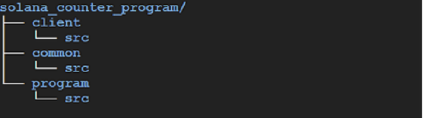

# Project Structure

The project uses Cargo [workspaces](https://doc.rust-lang.org/book/ch14-03-cargo-workspaces.html).



## Cargo Workspace

The workspace defined in `Cargo.toml` contains three members:

```toml
[workspace]
members = [
    "common",
    "program",
    "client",
]
```

## Crates

| Crate | Path | Purpose |
|-------|------|---------|
| `program` | `program/` | The on-chain Solana counter program (BPF) |
| `client` | `client/` | Rust CLI client that invokes the on-chain program |
| `common` | `common/` | Shared types (structs, enums) used by both program and client |

For experimentation, tweak files under `program/`, then [rebuild and redeploy](./quick-start.md) the on-chain program before re-running the client.
